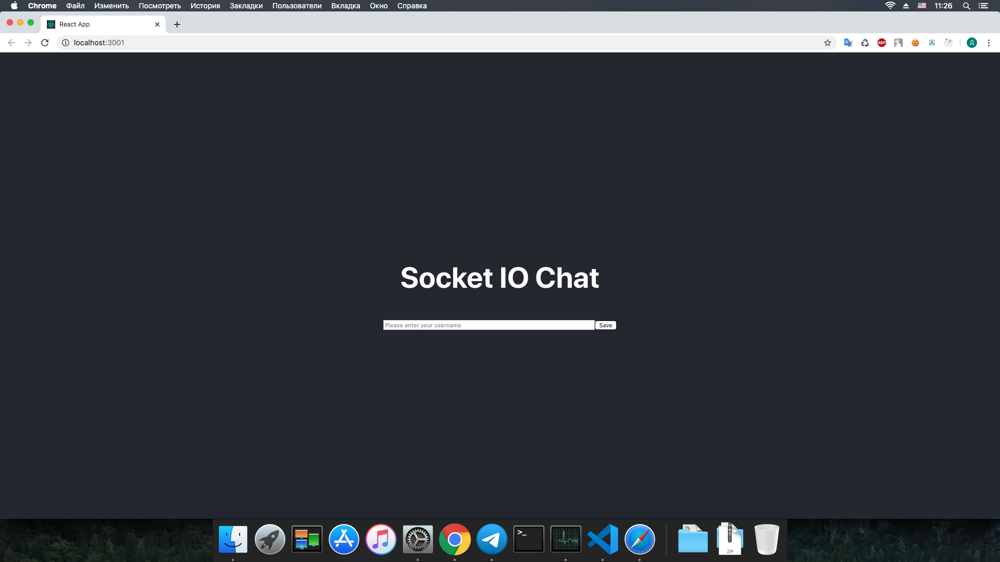
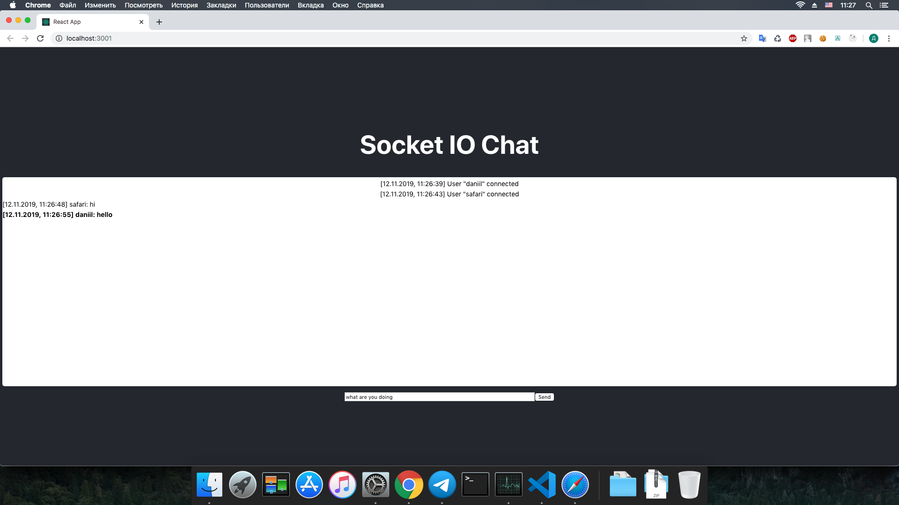

This chat was written on the following technologies: `React`, `Socket.IO`
## Available Scripts

In the project directory, you can run:

### `npm run start`

Runs the app. 
Open [http://localhost:3000](http://localhost:3000) to view it in the browser.

# Screenshots

